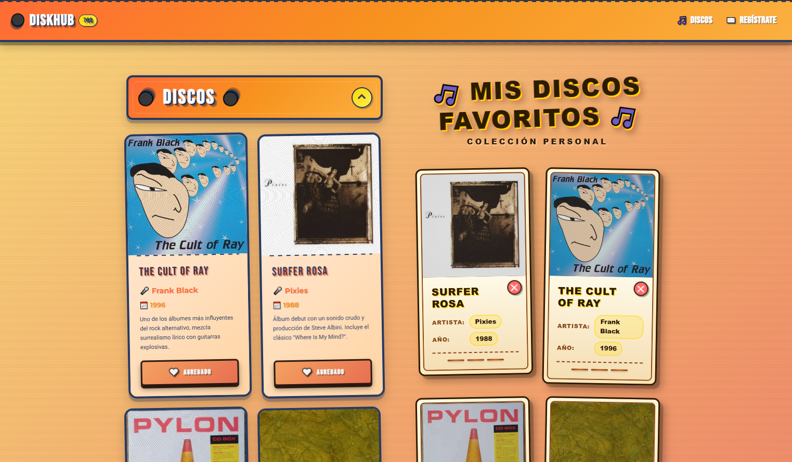
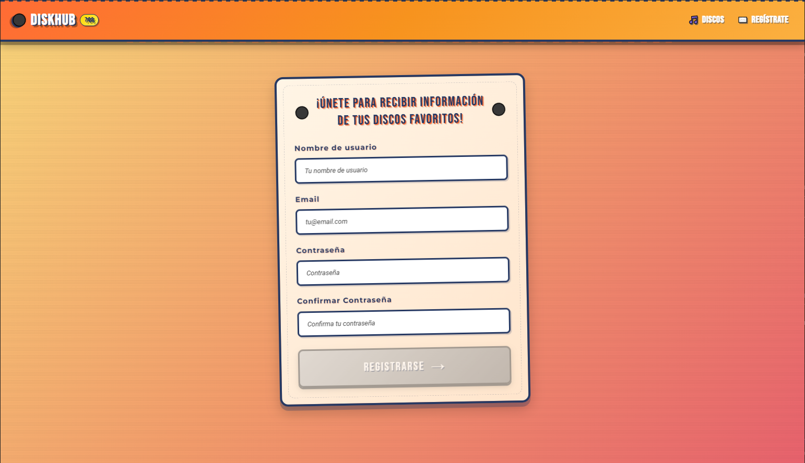

# DiskHub - Colección de Discos Retro

DiskHub es una aplicación web desarrollada con Angular, realizada para un seminario con el fin de aprender el framework. Permite a los usuarios explorar una lista de álbumes de música, ver sus detalles y agregarlos a una colección personal de favoritos. Inspirado en una estética retro de los años 70.

##  Características Principales

- **Interfaz Retro:** Diseño visualmente atractivo con animaciones y estilos que evocan la era del vinilo.
- **Lista de Discos:** Visualiza una colección de discos con su carátula, artista, año y descripción.
- **Sección de Favoritos:** Los usuarios pueden marcar discos como "favoritos" y estos se añaden a una sección personal.
- **Gestión de Estado:** La lista de favoritos se gestiona a través de un servicio de Angular, manteniendo el estado de la aplicación de forma centralizada.
- **Formulario de Registro Reactivo:** Un formulario para que los usuarios se registren, construido con **Angular Reactive Forms**, incluyendo validaciones en tiempo real.
- **Diseño Responsivo:** La aplicación se adapta a diferentes tamaños de pantalla, desde móviles hasta escritorios.

##  Tecnologías Utilizadas

Este proyecto fue construido utilizando las siguientes tecnologías:

- **[Angular](https://angular.io/):** El framework principal para construir la aplicación single-page (SPA).
  - **Componentes Standalone:** La arquitectura moderna de Angular para componentes más modulares y sencillos.
  - **Enrutamiento de Angular:** Para navegar entre la vista de discos y el formulario de registro.
  - **Servicios e Inyección de Dependencias:** Utilizado para gestionar el estado de los discos favoritos (`FavoriteDisksService`).

- **Angular Reactive Forms:** Para crear el formulario de registro. Permite manejar validaciones complejas, como la confirmación de contraseñas, de una manera robusta y escalable.

- **TypeScript:** Para añadir tipado estático a JavaScript, mejorando la calidad y mantenibilidad del código.

- **SCSS:** Preprocesador de CSS que permite usar variables, anidación y mixins para escribir estilos más organizados y reutilizables.

- **Bootstrap:** Utilizado para el sistema de grid y algunos componentes base, facilitando el diseño responsivo.
